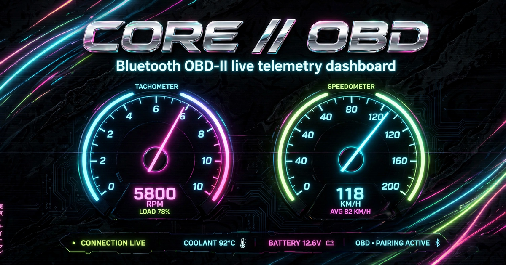

# CORE // OBD

CORE is a car dashboard that runs in a web page. Plug a Bluetooth adapter into your car's diagnostic port and the page shows live gauges: RPM, speed, temperatures, fuel, and more. It reads fault codes too.

The diagnostic port is the OBD-II port. Every car sold in the US since 1996 has one, usually under the dash on the driver's side.

**Live site:** https://core.askaconsult.com



## What it does

- Live gauges and readouts: RPM, speed, coolant temperature, intake temperature, throttle, engine load, fuel level, MAF, battery voltage, timing advance, fuel pressure, run time
- Shift light flashes past 6,200 RPM. Redline shown at 6,500.
- Reads and clears diagnostic trouble codes
- Two skins: Classic and Night Runners. The switcher sits in the header. Your choice is saved.
- Demo mode with a simulated drive, for exploring without a car
- MPH/km/h and °F/°C toggles. Wake lock keeps the screen on while you drive

## What you need

1. A Bluetooth Low Energy adapter (Bluetooth 4.0 or newer) for the OBD-II port. Veepeak OBDCheck BLE and Vgate iCar Pro BLE are known to work. Older Bluetooth 2.0 adapters do not work with web pages.
2. Chrome or Edge on Android, Windows, or Mac.
3. Ignition on. The engine can stay off for most readings.

On iPhone, Safari cannot use Bluetooth. Open the page in the free WebBLE app instead, or use demo mode.

## How to use it

1. Plug the adapter into the OBD-II port.
2. Turn the ignition on.
3. Open https://core.askaconsult.com in Chrome or Edge.
4. Tap Connect Bluetooth dongle and pick the adapter from the list.
5. Drive. The gauges update live.

No adapter? Tap Try demo mode on the connect screen.

## How it works

The whole app is one file: `index.html`. The page finds the adapter through Web Bluetooth, the browser feature that lets a web page talk to nearby Bluetooth devices. It then speaks the ELM327 command set, the standard language these adapters understand, to ask for sensor readings and fault codes.

Nothing is sent to a server. There is no backend.

```
index.html            the whole app
manifest.webmanifest  lets you install it as an app
og-image.png          share preview image
```

## Tested

- Target car: 2015 Toyota Corolla S
- The ELM327 protocol code is unit-tested: sensor parsing, fault code decoding, response cleanup, error detection
- The live Bluetooth link to a real adapter is not tested yet

## License

All rights reserved. Built by [Aska Solutions](https://askaconsult.com/digital).
